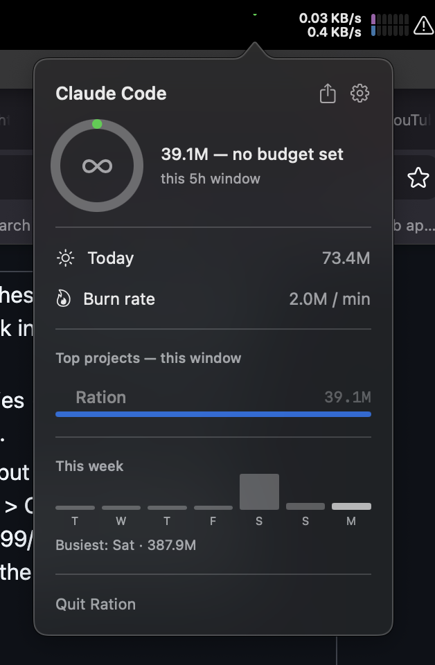
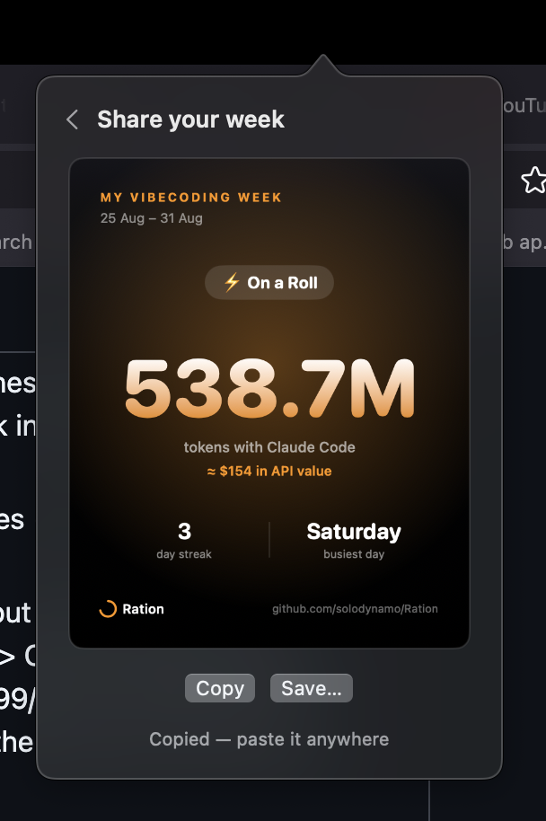

# Ration


A tiny native macOS menu-bar app that shows how hard you're leaning on
Claude Code — without leaving your desktop or running a terminal command.

<p align="center">
  
  
</p>

## Install

```bash
brew install solodynamo/ration/ration
```

Or [download the .dmg](https://github.com/solodynamo/Ration/releases/latest/download/Ration.dmg)
directly — drag Ration into Applications, then **right-click → Open** the
first time (it's ad-hoc signed, not notarized, so Gatekeeper needs that
one-time override; Homebrew does this for you automatically).

## What it does

- A ring in the menu bar tracks usage against a budget, auto-calibrated
  from your own history — or turn budgeting off entirely
- Breaks usage down by project, and by branch if you work across worktrees
- A 7-day trend, plus a shareable recap card (streak, busiest day, an
  API-equivalent $ estimate)
- **100% local.** Reads Claude Code's own session logs off disk. No
  accounts, no network calls, nothing leaves your machine.

## Build from source

```bash
swift build && swift test
```

Requires macOS 13+ and Xcode 16 / Swift 6.

```bash
./Scripts/build_app.sh   # -> dist/Ration.app
./Scripts/make_dmg.sh    # -> dist/Ration.dmg
```

## Contributing

Adding a provider beyond Claude Code means writing one type conforming to
`UsageProvider` (see `Sources/Ration/Providers/`) — aggregation, the ring,
and the rest of the UI are already provider-agnostic. PRs welcome.
